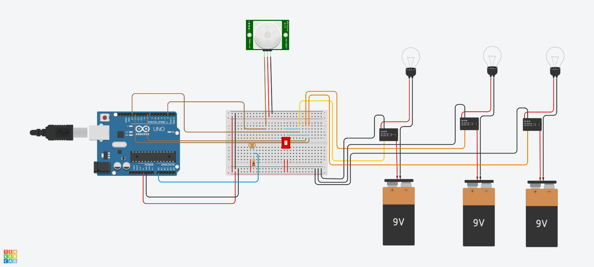

# Garage Light with Movement sensor

### Direct link to Tinkercad
> [Tinkercad Garage Movement Sensor](https://www.tinkercad.com/things/fFCJjZmjk7C?sharecode=7d-PJJWwWJTarnMVza9TA4n2aVFTUaRfwxnRSQngduo)

### Code
> [The Code of the Garage Movement Sensor](M242_GarageMovementSensor.ino)

### Circuit

