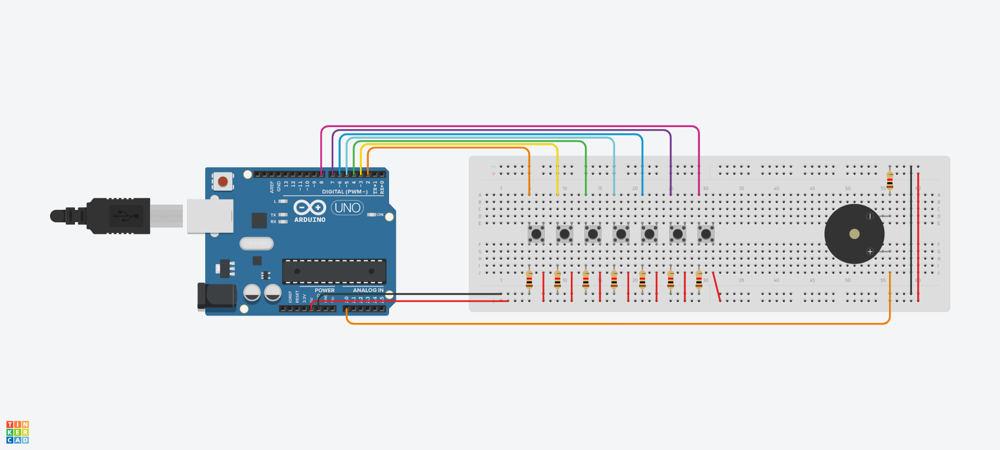

# Single octave Keyboard

### Direct link to Tinkercad
> [Tinkercad Keyboard](https://www.tinkercad.com/things/a9sHqaGat3x?sharecode=5CjMonmMraOQDE8KLrQYHqeNqLI3_nG0ZN0DUo8IsMQ)

### Code
> [The Code of the Keyboard](Keyboard/Keyboard_Octave.ino)

### Circuit

